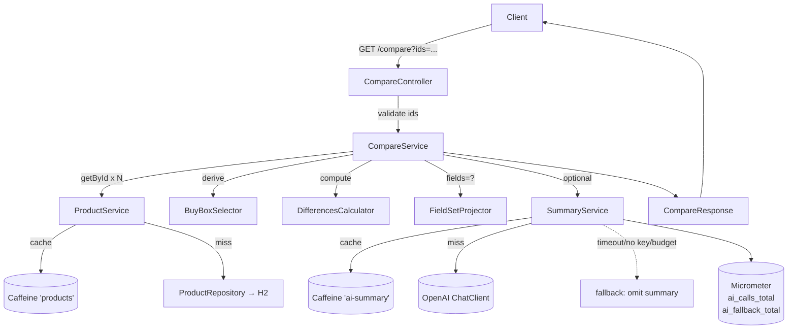

# Item Comparison API — Mercado Livre Challenge

Backend RESTful para a feature de comparação de produtos descrita no
desafio *Item Comparison V2* do Mercado Livre. A API expõe três operações
de leitura sobre um catálogo simulado, com cálculo determinístico de
diferenças entre produtos e um resumo opcional em linguagem natural
gerado por LLM (com fallback silencioso quando indisponível).

## TL;DR para o avaliador

```bash
mvn spring-boot:run                                  # sobe em :8080
open http://localhost:8080/swagger-ui.html           # contrato interativo
curl 'http://localhost:8080/api/v1/products/compare?ids=1,2'
```

Sem `OPENAI_API_KEY`, todos os endpoints funcionam normalmente — o campo
`summary` simplesmente é omitido na resposta de `/compare`. Com a chave
configurada (via `.env` ou variável de ambiente), o `summary` é populado
em &lt; 3 s na primeira chamada e &lt; 200 ms em cache hit.

## Endpoints

| Método | Path                                       | Descrição                                         |
|--------|--------------------------------------------|---------------------------------------------------|
| GET    | `/api/v1/products`                         | Listagem paginada (`page`, `size`, `category`).   |
| GET    | `/api/v1/products/{id}`                    | Detalhe completo + `buyBox`. Aceita `fields=...`. |
| GET    | `/api/v1/products/compare?ids=...`         | Compara 2-10 produtos. Aceita `fields`, `language`. |
| GET    | `/api/v1/products/category-insights?category=...` | Panorama de categoria: `rankings[]` + `topItems[]` + `summary` opcional. |

Erros seguem [RFC 7807](https://datatracker.ietf.org/doc/html/rfc7807)
com slugs `validation`, `bad-request`, `not-found`,
`products-not-found`, `method-not-allowed` e `internal`. Exemplos
completos em [`docs/specs/003-api-contract.md`](./docs/specs/003-api-contract.md).

## Stack

- **Java 21** + **Spring Boot 3.3.5** + **Maven 3.9+**
- **H2 in-memory** (modo PostgreSQL) com **Spring Data JPA**
- **Caffeine** para cache de produtos e respostas LLM
- **Spring AI** abstraindo OpenAI — apenas o `summary` opcional
- **springdoc-openapi 2.6** → Swagger UI em `/swagger-ui.html`
- **Spring Boot Actuator** + Micrometer para métricas
- **JUnit 5** + **AssertJ** + **MockMvc**, cobertura via **JaCoCo** ≥ 80 %

## Como rodar

### Requisitos
- JDK 21 (`java -version` reporta 21)
- Maven 3.9+ (`mvn -version`)

### Subir a aplicação

```bash
mvn spring-boot:run
```

A porta padrão é `8080`. Se já estiver ocupada (por ex. WireMock root),
use `SERVER_PORT=8081 mvn spring-boot:run`. O boot leva &lt; 10 s em
hardware moderno.

Para empacotar e rodar como jar:

```bash
mvn -DskipTests package
java -jar target/sample-1.0.0.jar
```

### Habilitar o `summary` LLM

Copie o template e preencha a chave:

```bash
cp .env.example .env
# edite .env e defina OPENAI_API_KEY=sk-...
```

Spring Boot carrega `OPENAI_API_KEY` do ambiente; o fluxo padrão é
exportar a variável no shell ou usar uma ferramenta como `direnv`. Sem a
chave, o serviço passa para o fallback determinístico
(documentado em [SPEC-004 §6](./docs/specs/004-ai-features.md)).

### Rodar a suíte de testes + cobertura

```bash
mvn verify
open target/site/jacoco/index.html
```

## Como avaliar (sugestão)

1. **Swagger UI** — `http://localhost:8080/swagger-ui.html` cobre os três
   endpoints com exemplos de request, schema de resposta e exemplos de
   erro RFC 7807.
2. **Smoke por curl** — comandos prontos abaixo cobrem happy path,
   sparse fields, cross-category e os principais fluxos de erro.
3. **Métricas** — `GET /actuator/metrics/ai_calls_total` mostra
   `outcome=ok|cache_hit|timeout|error` e `GET /actuator/metrics/ai_fallback_total`
   detalha os motivos de fallback (sem chave, budget exausto, etc.).
4. **Documentação SDD** — `docs/` traz o trilho completo de
   especificações, ADRs, plano e tasks. Ordem sugerida em
   [Trilho de leitura](#trilho-de-leitura-sdd).

### Curl rápidos

```bash
# listagem default (page=0, size=3)
curl 'http://localhost:8080/api/v1/products'

# filtro por categoria
curl 'http://localhost:8080/api/v1/products?category=SMARTPHONE&size=10'

# detalhe completo
curl 'http://localhost:8080/api/v1/products/1'

# detalhe com sparse fields (só nome e preço do buyBox)
curl 'http://localhost:8080/api/v1/products/1?fields=name,buyBox.price'

# compare happy path (mesma categoria)
curl 'http://localhost:8080/api/v1/products/compare?ids=1,2'

# compare cross-category (interseção de attributes + exclusiveAttributes)
curl 'http://localhost:8080/api/v1/products/compare?ids=1,21'

# compare em inglês
curl 'http://localhost:8080/api/v1/products/compare?ids=1,2&language=en'

# category insights — rankings determinísticos + summary opcional
curl 'http://localhost:8080/api/v1/products/category-insights?category=SMARTPHONE'

# category insights em inglês com top 3
curl 'http://localhost:8080/api/v1/products/category-insights?category=NOTEBOOK&topK=3&language=en'

# erros típicos
curl -i 'http://localhost:8080/api/v1/products/compare?ids=1,1'      # 400 duplicates
curl -i 'http://localhost:8080/api/v1/products/compare?ids=1,9999'   # 404 products-not-found
curl -i 'http://localhost:8080/api/v1/products/compare'              # 400 validation
curl -i -X POST 'http://localhost:8080/api/v1/products/compare?ids=1,2'  # 405
```

## Decisões arquiteturais de destaque

- **`CatalogProduct + Offer`** em vez de `Product` simples — espelha o
  modelo real do Mercado Livre. Detalhes em
  [SPEC-002 §1–§3](./docs/specs/002-product-domain-model.md).
- **`buyBox` derivado deterministicamente** por tier (NEW &gt;
  REFURBISHED &gt; USED), preço ascendente, reputação descendente,
  `sellerId` lexicográfico — ver
  [ADR-0004](./docs/adrs/0004-buybox-selection-heuristic.md).
- **Comparação híbrida**: camada determinística (`differences[]`) sempre
  presente; camada LLM (`summary`) opcional, com timeout 3.5 s, cache
  Caffeine de 5 min e fallback silencioso quando indisponível.
  [SPEC-001 §5.2](./docs/specs/001-item-comparison.md),
  [SPEC-004 §6](./docs/specs/004-ai-features.md).
- **`differences[]` em forma enxuta** — apenas atributos que diferem,
  com `winnerId` quando comparável numericamente.
  [SPEC-003 §2.3](./docs/specs/003-api-contract.md).
- **Cross-category compare** — `differences[]` opera sobre interseção de
  attribute keys; exclusivos vão para `exclusiveAttributes` e a flag
  `crossCategory: true` sinaliza o caso ao consumidor.
- **Skeleton de pacotes do desafio é fixo** (`controller / service /
  repository / model / exception`); a qualidade interna respeita esse
  layout — ver [ADR-0003](./docs/adrs/0003-keep-skeleton-paste-friendly-submission.md).
- **Busca semântica fora do escopo v1**, deliberadamente. O desafio
  pede *comparação*, não *busca*. A pipeline RAG completa (embeddings,
  vector store, outbox/Kafka, blue-green de modelos) está descrita com
  o mesmo rigor em [`docs/roadmap.md`](./docs/roadmap.md) §R-2.

## Fluxo do `/compare`



Pontos-chave:

- O LLM **nunca** está no caminho crítico de correção — uma falha do
  modelo apenas omite o `summary`, todo o resto da resposta permanece.
- `BuyBoxSelector` e `DifferencesCalculator` são funções puras
  testáveis em isolamento (golden tests em `src/test/`).
- Cache de produtos e cache de inferência são separados; o cache de
  inferência é chaveado por hash de `(ids, language, prompt version)`.

## Trilho de leitura SDD

Este projeto foi construído com **Spec-Driven Development**:

```
SPECIFY  →  PLAN  →  DECIDE (ADRs)  →  TASKS  →  IMPLEMENT  →  VERIFY  →  EVOLVE
```

Cada fase só começou com a anterior aprovada. Mudanças encontradas
durante a implementação retornam para a spec, são re-versionadas e
re-fluem — documentos não são retrofitados.

Ordem sugerida para auditoria:

1. [`docs/README.md`](./docs/README.md) — metodologia e índice
2. [`docs/specs/001-item-comparison.md`](./docs/specs/001-item-comparison.md) — *o que* e *por que*
3. [`docs/specs/002-product-domain-model.md`](./docs/specs/002-product-domain-model.md) — modelo de dados e invariantes
4. [`docs/specs/003-api-contract.md`](./docs/specs/003-api-contract.md) — contrato HTTP, RFC 7807, exemplos
5. [`docs/specs/004-ai-features.md`](./docs/specs/004-ai-features.md) — política de fallback, métricas, prompt versionado
6. [`docs/specs/005-category-insights.md`](./docs/specs/005-category-insights.md) — panorama de categoria (rankings determinísticos + summary opcional)
7. [`docs/adrs/`](./docs/adrs/) — cinco decisões arquiteturais com contexto, alternativas e consequências
8. [`docs/plan.md`](./docs/plan.md) e [`docs/plan-slice4.md`](./docs/plan-slice4.md) — sequência de implementação por slices funcionais
9. [`docs/TASKS.md`](./docs/TASKS.md) — tasks atômicas (T-01..T-30) com Definition of Done
10. [`docs/roadmap.md`](./docs/roadmap.md) — evolução para produção (R-1..R-10)

## Estrutura do repositório

```
.
├── README.md                    este arquivo
├── pom.xml                      Spring Boot 3.3.5, Java 21
├── .env.example                 template para OPENAI_API_KEY
├── docs/
│   ├── README.md                metodologia SDD
│   ├── specs/                   SPEC-001..004
│   ├── adrs/                    ADR-0001..0004
│   ├── plan.md                  sequência de slices
│   ├── TASKS.md                 tasks atômicas
│   └── roadmap.md               R-1..R-8
└── src/
    ├── main/
    │   ├── java/com/hackerrank/sample/
    │   │   ├── Application.java
    │   │   ├── controller/      ProductController, CompareController
    │   │   ├── exception/       GlobalExceptionHandler (RFC 7807)
    │   │   ├── model/           CatalogProduct, Offer, DTOs
    │   │   ├── repository/      ProductRepository (Spring Data JPA)
    │   │   └── service/         ProductService, CompareService,
    │   │                        BuyBoxSelector, DifferencesCalculator,
    │   │                        SummaryService, FieldSetProjector
    │   └── resources/
    │       ├── application.yml
    │       └── prompts/compare-summary.v1.md
    └── test/                    espelho da estrutura de main/
```

## O que não está aqui (e onde foi parar)

| Item                                            | Onde                  |
|-------------------------------------------------|-----------------------|
| Autenticação / autorização                      | não planejado         |
| Operações de escrita (POST/PUT/DELETE)          | não planejado         |
| Banco persistente                               | roadmap R-1           |
| Busca semântica (`/search` com embeddings)      | roadmap R-2.0 / R-3   |
| Filter extraction por LLM                       | roadmap R-3           |
| Rate limiting                                   | roadmap R-6           |
| Multi-currency / FX                             | roadmap R-8           |
| Multi-tenant / per-vertical prompts             | roadmap R-4           |

A omissão é deliberada e rastreada — não é dívida silenciosa.

## Licença

MIT — ver cabeçalho em `OpenApiConfig`.
