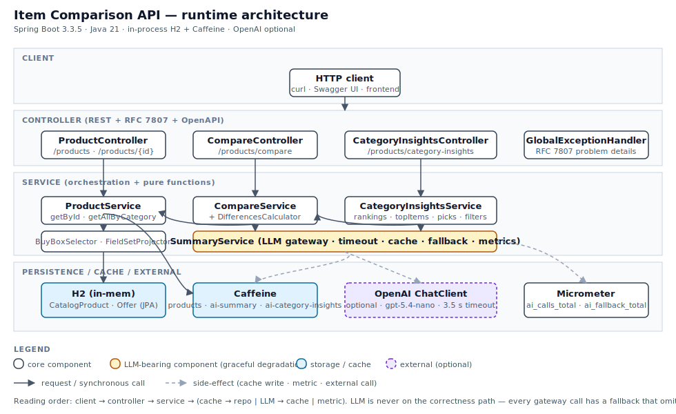
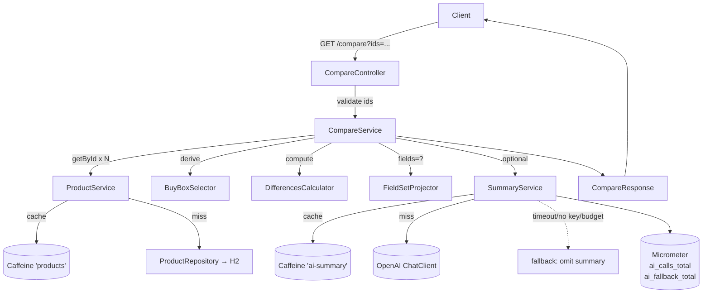

# Item Comparison API — Mercado Livre Challenge

Backend RESTful para a feature de comparação de produtos descrita no
desafio *Item Comparison V2* do Mercado Livre. A API expõe quatro
operações de leitura sobre um catálogo simulado, com cálculo
determinístico de diferenças entre produtos e um resumo opcional em
linguagem natural gerado por LLM (com fallback silencioso quando
indisponível).

## TL;DR para o avaliador

```bash
mvn spring-boot:run                                  # sobe em :8080
open http://localhost:8080/swagger-ui.html           # contrato interativo
curl 'http://localhost:8080/api/v1/products/compare?ids=1,2'
```

Sem `OPENAI_API_KEY`, todos os endpoints funcionam normalmente — o
campo `summary` simplesmente é omitido. Com a chave configurada (via
`.env` ou variável de ambiente), o `summary` é populado em < 3 s na
primeira chamada e < 200 ms em cache hit.

## Arquitetura



> *O SVG acima renderiza nativamente no GitHub e em qualquer viewer de
> markdown. Para uma versão interativa do mesmo fluxo, ver o diagrama
> Mermaid em [Fluxo do `/compare`](#fluxo-do-compare).*

Pontos-chave:

- **Camadas alinhadas com o skeleton do HackerRank** (`controller →
  service → repository / model / exception`) — restrição do desafio
  formalizada em [ADR-0003](docs/adrs/0003-keep-skeleton-paste-friendly-submission.md).
- **LLM nunca está no caminho crítico de correção.** Toda chamada ao
  modelo passa por `SummaryService`, que tem timeout 3.5 s, cache
  Caffeine de 5 min e fallback silencioso (omite o campo `summary`).
- **Funções puras isoláveis** — `BuyBoxSelector`,
  `DifferencesCalculator`, `FieldSetProjector`, `InsightsFilters` são
  testáveis sem Spring, com golden tests dedicados.
- **Caches separados** — `products`, `ai-summary` e
  `ai-category-insights` têm políticas de chave e expiração próprias.

## Endpoints

| Método | Path                                              | Descrição                                                |
|--------|---------------------------------------------------|----------------------------------------------------------|
| GET    | `/api/v1/products`                                | Listagem paginada (`page`, `size`, `category`).           |
| GET    | `/api/v1/products/{id}`                           | Detalhe completo + `buyBox`. Aceita `fields=...`.         |
| GET    | `/api/v1/products/compare?ids=...`                | Compara 2-10 produtos. Aceita `fields`, `language`.       |
| GET    | `/api/v1/products/category-insights?category=...` | Panorama: `rankings[]` + `topItems[]` + filtros + `summary` opcional. |

Erros seguem [RFC 7807](https://datatracker.ietf.org/doc/html/rfc7807)
com slugs `validation`, `bad-request`, `not-found`,
`products-not-found`, `method-not-allowed` e `internal`. Exemplos
completos em [`docs/specs/003-api-contract.md`](./docs/specs/003-api-contract.md).

## Stack

- **Java 21** + **Spring Boot 3.3.5** + **Maven 3.9+**
- **H2 in-memory** (modo PostgreSQL) com **Spring Data JPA**
- **Caffeine** para cache de produtos e respostas LLM
- **Spring AI** abstraindo OpenAI — apenas o `summary` opcional
- **springdoc-openapi 2.6** → Swagger UI em `/swagger-ui.html`
- **Spring Boot Actuator** + Micrometer para métricas
- **JUnit 5** + **AssertJ** + **MockMvc**, cobertura via **JaCoCo** ≥ 80 %

## Como rodar

### Requisitos
- JDK 21 (`java -version` reporta 21)
- Maven 3.9+

### Subir a aplicação

```bash
mvn spring-boot:run
```

A porta padrão é `8080`. Se já estiver ocupada, use
`SERVER_PORT=8081 mvn spring-boot:run`. Para empacotar e rodar como jar:

```bash
mvn -DskipTests package
java -jar target/sample-1.0.0.jar
```

### Habilitar o `summary` LLM

```bash
cp .env.example .env
# edite .env e defina OPENAI_API_KEY=sk-...
set -a && source .env && set +a
mvn spring-boot:run
```

Sem a chave, o serviço passa para o fallback determinístico
(documentado em [SPEC-004 §6](./docs/specs/004-ai-features.md)).

### Rodar a suíte de testes + cobertura

```bash
mvn verify
open target/site/jacoco/index.html
```

## Como avaliar

1. **Swagger UI** — `http://localhost:8080/swagger-ui.html` cobre os
   quatro endpoints com exemplos de request, schema de resposta e
   exemplos de erro RFC 7807.
2. **Smoke por curl** — comandos prontos abaixo cobrem happy path,
   sparse fields, cross-category, filtros de insights e fluxos de erro.
3. **Métricas** — `GET /actuator/metrics/ai_calls_total` mostra
   `outcome=ok|cache_hit|timeout|error`; `ai_fallback_total` detalha
   motivos (`no_key`, `budget`, `timeout`, etc).
4. **Trilho SDD** — começa em [`docs/README.md`](./docs/README.md).

### Curl rápidos

```bash
# listagem default
curl 'http://localhost:8080/api/v1/products'

# detalhe completo
curl 'http://localhost:8080/api/v1/products/1'

# detalhe com sparse fields
curl 'http://localhost:8080/api/v1/products/1?fields=name,buyBox.price'

# compare happy path (mesma categoria)
curl 'http://localhost:8080/api/v1/products/compare?ids=1,2'

# compare cross-category (interseção de attributes + exclusiveAttributes)
curl 'http://localhost:8080/api/v1/products/compare?ids=1,21'

# compare em inglês
curl 'http://localhost:8080/api/v1/products/compare?ids=1,2&language=en'

# category insights — rankings determinísticos + summary opcional
curl 'http://localhost:8080/api/v1/products/category-insights?category=SMARTPHONE'

# category insights filtrado por preço (R$ 1.000-3.000) e nota mínima
curl 'http://localhost:8080/api/v1/products/category-insights?category=SMARTPHONE&minPrice=1000&maxPrice=3000&minRating=4.5'

# erros típicos
curl -i 'http://localhost:8080/api/v1/products/compare?ids=1,1'        # 400 duplicates
curl -i 'http://localhost:8080/api/v1/products/compare?ids=1,9999'     # 404 products-not-found
curl -i 'http://localhost:8080/api/v1/products/category-insights?category=SMARTPHONE&minRating=6'  # 400 validation
curl -i -X POST 'http://localhost:8080/api/v1/products/compare?ids=1,2'  # 405
```

## Decisões arquiteturais de destaque

- **`CatalogProduct + Offer`** em vez de `Product` simples — espelha o
  modelo real do Mercado Livre.
  [SPEC-002 §1–§3](./docs/specs/002-product-domain-model.md).
- **`buyBox` derivado deterministicamente** por tier (NEW > REFURBISHED >
  USED), preço ascendente, reputação descendente, `sellerId`
  lexicográfico — [ADR-0004](./docs/adrs/0004-buybox-selection-heuristic.md).
- **Comparação híbrida** — `differences[]` sempre presente; `summary`
  opcional com timeout 3.5 s, cache Caffeine de 5 min e fallback
  silencioso. [SPEC-001 §5.2](./docs/specs/001-item-comparison.md),
  [SPEC-004 §6](./docs/specs/004-ai-features.md).
- **Cross-category compare** — `differences[]` opera sobre interseção
  de attribute keys; exclusivos vão para `exclusiveAttributes` e a
  flag `crossCategory: true` sinaliza o caso ao consumidor.
- **Category insights = panorama de categoria** — `rankings[]` com
  cobertura por atributo, `topItems[]` heurístico e `picks` internas
  alimentando um *buying guide* via LLM. Aceita filtros `minPrice` /
  `maxPrice` / `minRating` aplicados antes do ranking, com filtros
  hashed na cache key.
  [SPEC-005](./docs/specs/005-category-insights.md),
  [ADR-0005](./docs/adrs/0005-category-insights-endpoint-shape.md),
  [ADR-0006](./docs/adrs/0006-insights-filters-in-memory-with-scale-up-path.md).
- **Skeleton de pacotes do HackerRank é fixo** —
  [ADR-0003](./docs/adrs/0003-keep-skeleton-paste-friendly-submission.md).
- **Busca semântica fora do escopo v1**, deliberadamente. Pipeline RAG
  completa documentada com o mesmo rigor em
  [`docs/roadmap.md`](./docs/roadmap.md) §R-2.

## Fluxo do `/compare`



## Documentação

| Trilha | Onde |
|--------|------|
| Specs (SPEC-001..005) | [`docs/specs/`](./docs/specs/) |
| ADRs (0001..0006) | [`docs/adrs/`](./docs/adrs/) |
| Roadmap (R-1..R-10) | [`docs/roadmap.md`](./docs/roadmap.md) |
| Execution log (slices, T-01..T-35) | [`docs/execution/`](./docs/execution/) |
| Índice navegável | [`docs/README.md`](./docs/README.md) |

## Estrutura do repositório

```
.
├── README.md                   este arquivo
├── pom.xml                     Spring Boot 3.3.5, Java 21
├── .env.example                template para OPENAI_API_KEY
├── docs/
│   ├── README.md               índice SDD
│   ├── assets/architecture.svg diagrama de arquitetura
│   ├── specs/                  SPEC-001..005
│   ├── adrs/                   ADR-0001..0006
│   ├── roadmap.md              R-1..R-10
│   └── execution/              plan + TASKS por slice
└── src/
    ├── main/java/com/hackerrank/sample/
    │   ├── Application.java
    │   ├── controller/         REST + OpenAPI + advice
    │   ├── exception/          domain exceptions
    │   ├── model/              DTOs (records) + insights/
    │   ├── repository/         JPA entities + seed
    │   └── service/            ai/ + compare/ + insights/
    ├── main/resources/
    │   ├── application.yml
    │   ├── attribute-metadata.json
    │   └── prompts/            compare-summary.v2.md, category-insights.v3.md
    └── test/                   espelho da estrutura de main/
```

## O que não está aqui (e onde foi parar)

| Item                                            | Onde            |
|-------------------------------------------------|-----------------|
| Autenticação / autorização                      | não planejado   |
| Operações de escrita (POST/PUT/DELETE)          | não planejado   |
| Banco persistente                               | roadmap R-1     |
| Busca semântica (`/search` com embeddings)      | roadmap R-2/R-3 |
| Filter extraction por LLM                       | roadmap R-3     |
| Rate limiting                                   | roadmap R-6     |
| Multi-currency / FX                             | roadmap R-8     |
| Multi-tenant / per-vertical prompts             | roadmap R-4     |

A omissão é deliberada e rastreada — não é dívida silenciosa.

## Licença

MIT — ver cabeçalho em `OpenApiConfig`.
