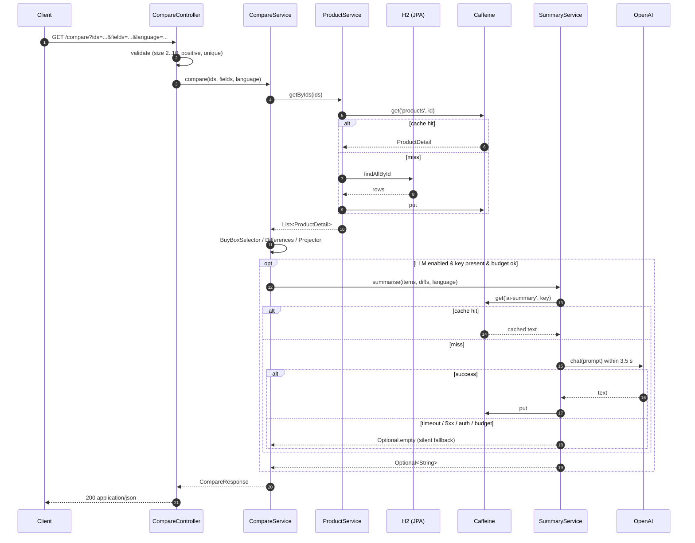

# Item Comparison API — Mercado Livre Challenge

Comparing items in a catalogue is a **hybrid problem**. The factual
side — which product is cheaper, has more battery, is heavier — must
be deterministic and auditable. The narrative side — *given all of
that, which one fits a budget shopper?* — reads better as one
well-written paragraph than as a row of cells. This service handles
the two as separate concerns: a lexical core computes
`differences[]` and `rankings[]` deterministically, and an LLM is
given a narrow, narrative-only job (the optional `summary`) with a
silent fallback so the API stays a 200 when the model is down.

Four read endpoints over a simulated catalogue, RFC 7807 error
shape, JaCoCo ≥ 80 %, 156 unit + integration tests green.

> **Looking for the story behind the design?** Start with
> [`docs/walkthrough.md`](docs/walkthrough.md) — a 10-minute tour
> covering hybrid comparison, the AI summary path, the SDD slices and
> the decisions worth questioning. The [specs](docs/specs/) and
> [ADRs](docs/adrs/) carry the contractual depth.

## TL;DR for the reviewer

```bash
mvn spring-boot:run                                  # starts on :8080
open http://localhost:8080/swagger-ui.html           # interactive contract
curl 'http://localhost:8080/api/v1/products/compare?ids=1,2'
```

Without `OPENAI_API_KEY`, every endpoint works normally — the
`summary` field is simply omitted. With the key configured (via
`.env` or environment variable), `summary` is populated in < 3 s on
the first call and < 200 ms on cache hit.

## Architecture

```
                       +-----------------------------+
                       |           Client            |
                       +--------------+--------------+
                                      | HTTP (RFC 7807 errors)
                       +--------------v--------------+
                       |   Controllers + Advice       |
                       |   Product / Compare /        |
                       |   CategoryInsights           |
                       +--------------+--------------+
                                      |
       +------------------------------+------------------------------+
       |                              |                              |
+------v---------+           +--------v---------+           +--------v---------+
|  ProductService|           |  CompareService  |           | InsightsService  |
|  sparse fields |           |  + BuyBoxSelector|           |  + InsightsFilters
|  Caffeine      |           |  + Differences   |           |  + Rankings      |
|  'products'    |           |  + Projector     |           |  + TopItems      |
|                |           |                  |           |  + Picks (det.)  |
+------+---------+           +--------+---------+           +--------+---------+
       |                              |                              |
       |                              v                              |
       |                     +------------------+                    |
       |                     | SummaryService   |<-------------------+
       |                     |  prompt files    |   (optional, async)
       |                     |  3.5 s timeout   |
       |                     |  Caffeine cache  |
       |                     |  DailyBudget     |
       |                     |  silent fallback |
       |                     +--------+---------+
       |                              |
+------v---------+              +-----v----------+
|  H2 + JPA      |              |  OpenAI        |
|  in-memory     |              |  (Spring AI)   |
+----------------+              +----------------+

  Metrics: ai_calls_total · ai_fallback_total · ai_tokens_total · cache_hit ratios
  Caches : 'products' (TTL 30s) · 'ai-summary' (5min) · 'ai-category-insights' (5min)
```

Key points:

- **Layers aligned with the HackerRank skeleton** (`controller →
  service → repository / model / exception`) — challenge constraint
  formalised in [ADR-0003](docs/adrs/0003-keep-skeleton-paste-friendly-submission.md).
- **The LLM is never on the critical path of correctness.** Every
  model call goes through `SummaryService`, which has a 3.5 s
  timeout, a 5-minute Caffeine cache and a silent fallback (the
  `summary` field is simply omitted).
- **Pure, isolable functions** — `BuyBoxSelector`,
  `DifferencesCalculator`, `FieldSetProjector`, `InsightsFilters`
  are testable without Spring, with dedicated golden tests.
- **Separate caches** — `products`, `ai-summary` and
  `ai-category-insights` each have their own key shape and
  expiration policy.

### Sequence — `/compare` end-to-end



## Endpoints

| Method | Path                                              | Description                                                |
|--------|---------------------------------------------------|------------------------------------------------------------|
| GET    | `/api/v1/products`                                | Paged listing (`page`, `size`, `category`).                |
| GET    | `/api/v1/products/{id}`                           | Full detail + `buyBox`. Accepts `fields=...`.              |
| GET    | `/api/v1/products/compare?ids=...`                | Compares 2–10 products. Accepts `fields`, `language`.      |
| GET    | `/api/v1/products/category-insights?category=...` | Landscape: `rankings[]` + `topItems[]` + filters + optional `summary`. |

Errors follow [RFC 7807](https://datatracker.ietf.org/doc/html/rfc7807)
with the slugs `validation`, `bad-request`, `not-found`,
`products-not-found`, `method-not-allowed` and `internal`. Full
examples in [`docs/specs/003-api-contract.md`](./docs/specs/003-api-contract.md).

## Stack

- **Java 21** + **Spring Boot 3.3.5** + **Maven 3.9+**
- **H2 in-memory** (PostgreSQL mode) with **Spring Data JPA**
- **Caffeine** for product and LLM-response caches
- **Spring AI** abstracting OpenAI — only the optional `summary`
- **springdoc-openapi 2.6** → Swagger UI at `/swagger-ui.html`
- **Spring Boot Actuator** + Micrometer for metrics
- **JUnit 5** + **AssertJ** + **MockMvc**, coverage via **JaCoCo** ≥ 80 %

## How to run

### Requirements
- JDK 21 (`java -version` reports 21)
- Maven 3.9+

### Start the application

```bash
mvn spring-boot:run
```

The default port is `8080`. If it is already in use, run
`SERVER_PORT=8081 mvn spring-boot:run`. To package and run as a jar:

```bash
mvn -DskipTests package
java -jar target/sample-1.0.0.jar
```

### Enable the LLM `summary`

```bash
cp .env.example .env
# edit .env and set OPENAI_API_KEY=sk-...
set -a && source .env && set +a
mvn spring-boot:run
```

Without the key, the service falls back to its deterministic
behaviour (documented in [SPEC-004 §6](./docs/specs/004-ai-features.md)).

### Run the test suite + coverage

```bash
mvn verify
open target/site/jacoco/index.html
```

## How to evaluate

1. **Swagger UI** — `http://localhost:8080/swagger-ui.html` covers
   the four endpoints with request examples, response schemas and
   RFC 7807 error examples.
2. **Curl smoke** — the commands below cover happy paths, sparse
   fields, cross-category, insights filters and error flows.
3. **Metrics** — `GET /actuator/metrics/ai_calls_total` exposes
   `outcome=ok|cache_hit|timeout|error`; `ai_fallback_total`
   breaks down reasons (`no_key`, `budget`, `timeout`, etc).
4. **SDD trail** — start at [`docs/README.md`](./docs/README.md).

### Quick curls

```bash
# default listing
curl 'http://localhost:8080/api/v1/products'

# full detail
curl 'http://localhost:8080/api/v1/products/1'

# detail with sparse fields
curl 'http://localhost:8080/api/v1/products/1?fields=name,buyBox.price'

# compare happy path (same category)
curl 'http://localhost:8080/api/v1/products/compare?ids=1,2'

# compare cross-category (intersection of attributes + exclusiveAttributes)
curl 'http://localhost:8080/api/v1/products/compare?ids=1,21'

# compare in English
curl 'http://localhost:8080/api/v1/products/compare?ids=1,2&language=en'

# category insights — deterministic rankings + optional summary
curl 'http://localhost:8080/api/v1/products/category-insights?category=SMARTPHONE'

# category insights filtered by price (BRL 1,000–3,000) and minimum rating
curl 'http://localhost:8080/api/v1/products/category-insights?category=SMARTPHONE&minPrice=1000&maxPrice=3000&minRating=4.5'

# typical error responses
curl -i 'http://localhost:8080/api/v1/products/compare?ids=1,1'        # 400 duplicates
curl -i 'http://localhost:8080/api/v1/products/compare?ids=1,9999'     # 404 products-not-found
curl -i 'http://localhost:8080/api/v1/products/category-insights?category=SMARTPHONE&minRating=6'  # 400 validation
curl -i -X POST 'http://localhost:8080/api/v1/products/compare?ids=1,2'  # 405
```

## Architectural decisions worth highlighting

- **`CatalogProduct + Offer`** instead of a flat `Product` — mirrors
  the real-world Mercado Livre data model.
  [SPEC-002 §1–§3](./docs/specs/002-product-domain-model.md).
- **`buyBox` derived deterministically** by tier
  (NEW > REFURBISHED > USED), ascending price, descending reputation,
  lexicographic `sellerId` —
  [ADR-0004](./docs/adrs/0004-buybox-selection-heuristic.md).
- **Hybrid comparison** — `differences[]` is always present;
  `summary` is optional, with a 3.5 s timeout, a 5-minute Caffeine
  cache and a silent fallback.
  [SPEC-001 §5.2](./docs/specs/001-item-comparison.md),
  [SPEC-004 §6](./docs/specs/004-ai-features.md).
- **Cross-category compare** — `differences[]` operates on the
  intersection of attribute keys; the exclusives go into
  `exclusiveAttributes` and the `crossCategory: true` flag signals
  the case to the consumer.
- **Category insights as a category landscape** — `rankings[]` with
  per-attribute coverage, heuristic `topItems[]` and internal
  `picks` feeding a *buying guide* via the LLM. Accepts
  `minPrice` / `maxPrice` / `minRating` filters applied before the
  ranking, with filters hashed into the cache key.
  [SPEC-005](./docs/specs/005-category-insights.md),
  [ADR-0005](./docs/adrs/0005-category-insights-endpoint-shape.md),
  [ADR-0006](./docs/adrs/0006-insights-filters-in-memory-with-scale-up-path.md).
- **HackerRank package skeleton is fixed** —
  [ADR-0003](./docs/adrs/0003-keep-skeleton-paste-friendly-submission.md).
- **Semantic search out of v1 scope**, deliberately. The full RAG
  pipeline is documented with the same rigor in
  [`docs/roadmap.md`](./docs/roadmap.md) §R-2.

## Documentation

| Track | Where |
|-------|-------|
| Narrative walkthrough (10 min) | [`docs/walkthrough.md`](./docs/walkthrough.md) |
| Navigable index (SDD) | [`docs/README.md`](./docs/README.md) |
| Specs (SPEC-001..005) | [`docs/specs/`](./docs/specs/) |
| ADRs (0001..0006) | [`docs/adrs/`](./docs/adrs/) |
| Roadmap (R-1..R-10) | [`docs/roadmap.md`](./docs/roadmap.md) |
| Execution log (slices, T-01..T-35) | [`docs/execution/`](./docs/execution/) |

## Repository layout

```
.
├── README.md                   this file
├── pom.xml                     Spring Boot 3.3.5, Java 21
├── .env.example                template for OPENAI_API_KEY
├── docs/
│   ├── README.md               SDD index
│   ├── walkthrough.md          narrative tour (architecture, AI, SDD)
│   ├── specs/                  SPEC-001..005
│   ├── adrs/                   ADR-0001..0006
│   ├── roadmap.md              R-1..R-10
│   └── execution/              plan + TASKS per slice
└── src/
    ├── main/java/com/hackerrank/sample/
    │   ├── Application.java
    │   ├── controller/         REST + OpenAPI + advice
    │   ├── exception/          domain exceptions
    │   ├── model/              DTOs (records) + insights/
    │   ├── repository/         JPA entities + seed
    │   └── service/            ai/ + compare/ + insights/
    ├── main/resources/
    │   ├── application.yml
    │   ├── attribute-metadata.json
    │   └── prompts/            compare-summary.v2.md, category-insights.v3.md
    └── test/                   mirrors the structure of main/
```

## What is not here (and where it lives)

| Item                                            | Where            |
|-------------------------------------------------|------------------|
| Authentication / authorization                  | not planned      |
| Write operations (POST/PUT/DELETE)              | not planned      |
| Persistent database                             | roadmap R-1      |
| Semantic search (`/search` with embeddings)     | roadmap R-2/R-3  |
| LLM filter extraction                           | roadmap R-3      |
| Rate limiting                                   | roadmap R-6      |
| Multi-currency / FX                             | roadmap R-8      |
| Multi-tenant / per-vertical prompts             | roadmap R-4      |

The omissions are deliberate and tracked — not silent debt.

## License

MIT — see the header in `OpenApiConfig`.
