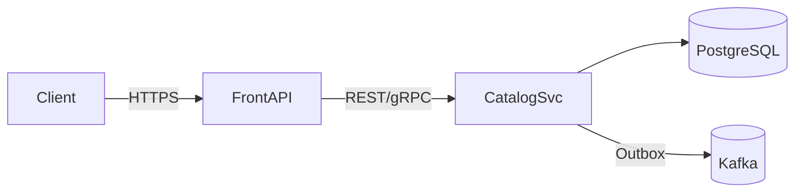
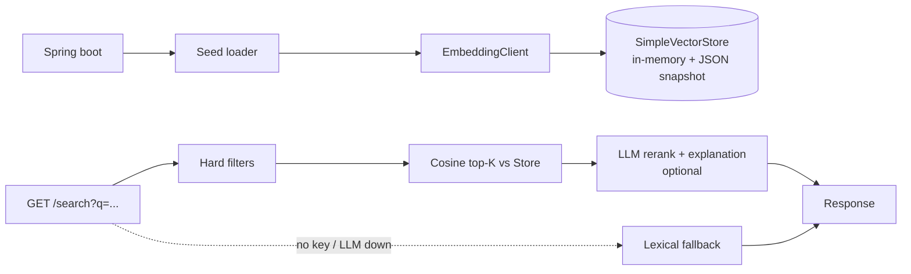
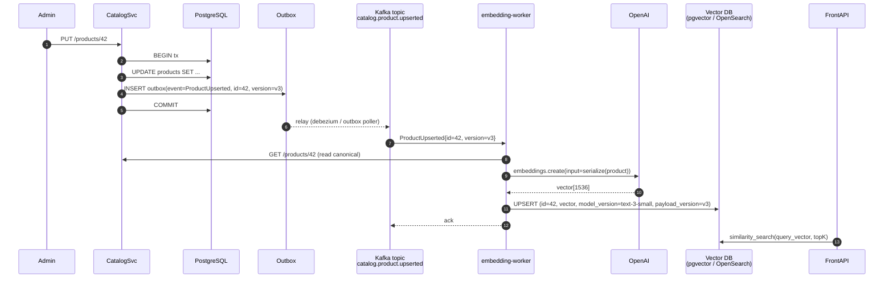
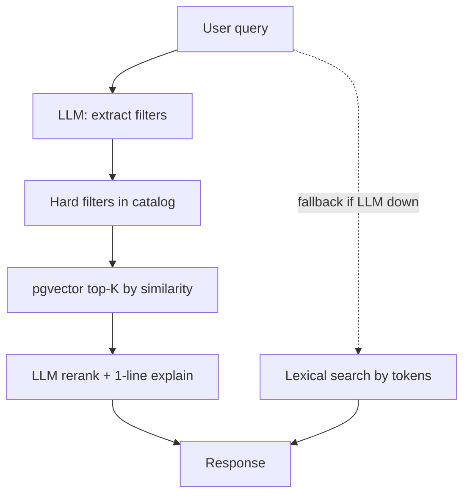

# Roadmap — From challenge to production

This roadmap is part of the SDD trail. Every entry follows the same shape:

> **Trigger** — what business or technical signal opens the item.
> **Approach** — concrete strategy.
> **Architecture** — diagram or component sketch.
> **Tradeoffs** — what we accept by choosing this.
> **Effort** — order-of-magnitude estimate.

Items are independent: the order below is *recommended*, not *required*.

## Principles that constrain every step

- **Backwards compatibility on the public API.** Versioning by URL prefix
  (`/api/v1`, `/api/v2`); a v1 client never breaks because of a server
  evolution. Internal contracts can change freely.
- **Reversibility.** Every step ships behind a feature flag or a config
  switch so it can be turned off without a redeploy.
- **Cost-aware AI.** Any LLM/embedding feature ships with timeouts, daily
  budgets, and a deterministic fallback. The product never depends on the
  LLM being available.
- **Observability before optimization.** No tuning is done before metrics
  are in place. *No measure, no change.*

---

## R-1 · Catalog as a service

**Trigger.** The catalog grows past what fits comfortably in H2 (~10⁴
products), or another team needs to write to it.

**Approach.** Extract the `repository` package into a standalone
`catalog-service` (Spring Boot, PostgreSQL). The current `front-api` keeps
its `controller`/`service` layers and consumes the catalog over REST or
gRPC.

**Architecture.**

**Tradeoffs.** Network hop adds 1–5 ms; gain is independent scaling and a
clear ownership boundary. PostgreSQL replaces H2 for both relational data
and JSON attributes (`jsonb`).

**Effort.** ~3 dev-days for the extraction, plus ~1 for migration tests.

---

## R-2 · Semantic search — from zero to scale

The challenge prompt asks for a comparison API. Semantic search is a
neighbouring feature that adds clear product value (natural-language
discovery: *"a fridge that fits in 60 cm under R$ 3000"*) but introduces
a substantially larger surface: embeddings, a vector store, snapshot
management, model versioning, and a real cost angle. v1 deliberately
**does not ship search** — it stays focused on the asked-for
comparison. This roadmap entry captures the introduction *and* the
scale-up path with the same rigor it would have if it were in scope.

### R-2.0 Introduction (single-process, in-memory)

**Trigger.** Product or business asks for natural-language discovery
across the catalog, and the catalog still fits comfortably in memory
(~10² to ~10³ products).

**Approach.**

1. Add Spring AI's `EmbeddingClient` and `SimpleVectorStore` (in-memory).
2. On boot, serialize each `CatalogProduct` to the deterministic payload
   defined originally in SPEC-002 v2 §7 (`<name>. <description>.
   Category: <cat>. Specifications: k=v; ...`) and embed it.
3. Persist the in-memory store to disk as a JSON snapshot
   (`./.cache/vectors.json`, `.gitignored`) so reboots avoid re-paying
   for embeddings. Snapshot is invalidated by a hash of `(model, seed
   file)`.
4. Expose `GET /api/v1/products/search?q=&category=&maxPrice=&topK=`:
   query embedded → cosine similarity → top-K → optional LLM rerank
   with one-line `explanation` per hit.
5. **Lexical fallback** (`name + description + attributes` regex) when
   no `OPENAI_API_KEY` is set. The endpoint never returns 503.
6. Hard filters (`category`, `maxPrice`) are applied on the structured
   side **before** vector ranking — the LLM does not see filtered-out
   products.

**Architecture.**

**Tradeoffs.** This is "level 2" RAG: good enough for a catalog the
size of a demo or an MVP, terrible for a mutable production catalog.
Updates require a full re-embed (boot-time only). No write path — the
moment any team needs to insert/update/delete products at runtime,
move to R-2.1.

**Effort.** ~2 dev-days including snapshot, lexical fallback, prompt
template, and tests with a stubbed `EmbeddingClient`.

### R-2.1 Lifecycle of a product update at scale

Key properties of this design:

- **Outbox pattern** — the embedding worker never reads from the
  application database directly; it consumes events emitted as part of the
  same DB transaction that wrote the product. No "lost event" race.
- **Idempotency** — every event carries a monotonic `version`. The worker
  drops events with a version older than what is already in the vector
  store. Replays from the topic are safe.
- **Eventual consistency** — search reflects writes within seconds, not
  milliseconds. This is the right tradeoff: comparison reads are by id
  (always strongly consistent via `CatalogSvc`), only semantic search is
  eventually consistent. Document this in the API contract.
- **Worker isolation** — the embedding worker is a separate deployable.
  It can be scaled, paused, or rate-limited without touching the API.

### R-2.2 Insert and delete

- **Insert.** Same flow as update; the vector store treats it as an
  upsert. No special path.
- **Delete.** Catalog emits `ProductDeleted{id, version}`. Worker removes
  the vector from the store. The worker also tombstones recently deleted
  ids for `~24 h` to absorb out-of-order events.

### R-2.3 Embedding model versioning

Embeddings produced by `text-embedding-3-small` are not comparable with
embeddings from a different model. When upgrading models:

1. Bring up the new model alongside the old one.
2. Re-embed the entire catalog into a *new* index/namespace
   (`embeddings_v2`) using the worker, throttled by the daily budget.
3. Switch read traffic to the new index behind a feature flag, with
   shadow-comparing precision/recall on a labeled sample.
4. Remove the old index once stable.

This is **blue-green for vector indexes**. It is mandatory whenever the
embedding model or the serialization format of the input changes.

### R-2.4 Backpressure and cost guard

- **Token budget per day**, enforced at the worker (`AI_DAILY_REQUEST_LIMIT`).
  Excess events park on the topic with consumer lag observable in
  Grafana — no data loss, just slower index freshness.
- **Per-event cost telemetry** — `ai_embedding_tokens_total{model=...}` is
  emitted per event. The cost dashboard is computed from these counters.
- **Circuit breaker** on the OpenAI client (Resilience4j). When tripped,
  the worker pauses consumption rather than burning the budget on
  failures.

### R-2.5 Vector store choices

| Option         | When to pick                                                      |
|----------------|-------------------------------------------------------------------|
| `pgvector`     | Already on PostgreSQL, < 10⁶ products, want one less infra piece. |
| `OpenSearch` k-NN | Already on OpenSearch for full-text; combines lexical + vector. |
| `Weaviate`/`Qdrant` | Need hybrid search and rich metadata filters out of the box. |
| Managed (Pinecone) | No platform team, willing to pay for SLA.                     |

We default to **pgvector** in R-2.5 because it ships with the catalog DB
and is good enough up to ~10⁶ documents.

**Tradeoffs.** This pipeline is not free: it adds a topic, a worker, an
outbox, and a vector DB. The win is that the index is always *correct*
and the API is decoupled from OpenAI's availability.

**Effort.** R-2.0 (introduction) ~2 dev-days. R-2.1 to R-2.4 (scale-up)
~5 dev-days on top. R-2.5 (pgvector) ~1 day.

---

## R-3 · Search level 3 — hybrid retrieval

**Trigger.** R-2.0 (level 2 RAG) is live, but quality plateaus on queries
that mix hard constraints (size, price) with soft preferences (style,
use case).

**Approach.** Two-stage retrieval:

1. **LLM filter extraction** — `query → { category, price≤X, width≤Y, ... }`.
   Cheap, structured, validated by Bean Validation. Anything the LLM
   outputs that does not match a known attribute is dropped, not raised.
2. **Vector similarity** on the filtered universe.
3. **LLM rerank + explanation** on the top K.

**Architecture.**

**Tradeoffs.** One extra LLM call per query (cost). Two-stage error mode:
extractor can drop a useful soft constraint. Mitigated by always
embedding the *original* query in the rerank context.

**Effort.** ~3 dev-days on top of R-2.

---

## R-4 · Comparison v3 — multi-tenant prompts and personalization

**Trigger.** Different verticals (electronics vs fashion vs grocery) want
the comparison summary to emphasize different things.

**Approach.** Prompts as **versioned resources** (`prompts/compare/v3.md`)
selected by `category` and optionally by `tenantId`. Per-tenant rate
limits and overrides. A/B testing of prompt variants with outcome metrics
(click-through on each compared product, time on page) collected via a
dedicated event topic.

**Tradeoffs.** Prompt sprawl is the real risk. Mitigation: every prompt
in git, with a one-paragraph rationale and a regression test that pins a
golden output for a fixed input.

**Effort.** ~2 dev-days for the framework, ongoing for each vertical.

---

## R-5 · Compared-pairs analytics

**Trigger.** Product team wants to know what users actually compare so
the catalog can highlight competitive pairs.

**Approach.** Every compare call emits a `ComparisonRequested` event with
the (sorted) ids and timestamp. A streaming job (Flink / Kafka Streams)
maintains rolling top-pairs by category. Surface in an internal dashboard
and feed back into "frequently compared" UI hints.

**Tradeoffs.** Privacy: events are catalog ids only, no user PII unless
strictly needed and consented.

**Effort.** ~3 dev-days end to end.

---

## R-6 · Resilience and SLO

**Trigger.** The API leaves "demo" status and gets a real SLO.

**Approach.**

- Per-endpoint **SLO** (e.g. `GET /products/{id}` 99.9 % availability,
  P95 < 100 ms cached / < 300 ms cold).
- Resilience4j **circuit breakers** on every cross-service call (catalog,
  OpenAI, vector DB).
- **Bulkheads** — separate thread pools for AI calls so a stuck OpenAI
  request cannot exhaust the connector pool.
- **Adaptive timeouts** based on observed P99 latency.
- **Chaos drills** — kill OpenAI, kill vector DB, kill catalog, in a
  staging environment monthly.

**Effort.** ~4 dev-days plus ongoing.

---

## R-7 · Observability uplift

**Trigger.** Anything beyond local development.

**Approach.**

- **OpenTelemetry** for traces; correlation id from the edge through
  catalog and AI workers.
- **Micrometer** metrics already exposed in v1; route to Prometheus +
  Grafana, dashboards versioned in git (`infra/grafana/`).
- **Structured JSON logs** with `trace_id`, `tenant_id`, `cache_hit`,
  `ai_used`, `ai_fallback_reason` fields. Loki or CloudWatch.
- **AI-specific signals** (counter set):
  - `ai_calls_total{kind=summary|search, outcome=ok|timeout|error|fallback}`
  - `ai_latency_seconds{kind=...}`
  - `ai_tokens_total{kind=...,direction=in|out}`
  - `vector_search_latency_seconds`
  - `cache_hits_total{cache=products|ai_summary|embeddings}`

**Effort.** ~3 dev-days for the first wave.

---

## R-8 · Multi-region / multi-currency

**Trigger.** The product expands to a second country in MELI.

**Approach.** `currency` and `locale` become first-class on `Offer` (not
`CatalogProduct`). Comparisons within a region only. Search prompts
localized; embeddings can stay multilingual (`text-embedding-3-small`
handles ~100 languages reasonably) or split per language for precision.

**Tradeoffs.** Re-embedding cost when adding a language. Currency
conversion is a UX decision — we do *not* convert in the API; we expose
the offer's native currency.

**Effort.** ~5 dev-days.

---

## What we explicitly do not plan to do

- **GraphQL.** REST + sparse fieldsets covers the same need with less
  infrastructure for our scale.
- **WebSocket / SSE for compare.** Inline summary with timeout is the
  right shape; streaming is a UX preference, not a backend constraint.
- **Custom-trained ranking model.** Off-the-shelf embeddings + LLM rerank
  is enough until we have labeled relevance data, which we will not have
  until R-5 has been live for months.
- **Edge / CDN caching of compare.** Combinatorial keyspace makes the
  hit-rate too low to justify; per-product GET already supports `ETag`
  for client and CDN caching.

## Effort summary

| Item | Days | Order |
|------|------|-------|
| R-1 Catalog as a service | 4 | First if scale forces it |
| R-2.0 Semantic search introduction | 2 | First AI-discovery bet |
| R-2.1–2.5 Embedding pipeline at scale | 6 | After R-2.0 outgrows in-memory |
| R-3 Hybrid search (level 3) | 3 | After R-2.1+ |
| R-4 Multi-tenant prompts | 2+ | When verticals diverge |
| R-5 Comparison analytics | 3 | Product-driven |
| R-6 Resilience / SLO | 4 | Production gate |
| R-7 Observability uplift | 3 | Production gate |
| R-8 Multi-region | 5 | Business-driven |

## Changelog

- **v2 (2026-04-28)** — Added R-2.0 (Semantic search introduction) at
  the top of R-2 to capture the level-2 RAG that v1 of SPEC-001
  originally proposed and that v3 deferred. R-2.1+ explicitly described
  as the scale-up path. R-3 trigger reworded to depend on R-2.0. Effort
  table split R-2.0 from R-2.1–2.5.
- **v1 (2026-04-28)** — Initial draft. Captures embedding pipeline at
  scale, hybrid search evolution, observability and resilience uplifts.
