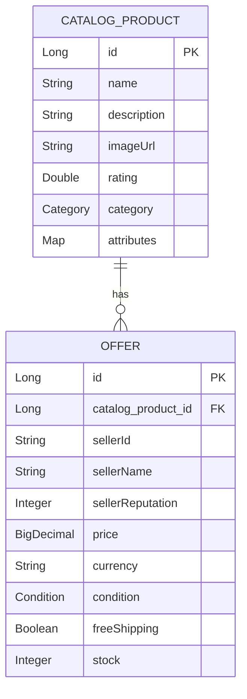

# SPEC-002 — Catalog Product Domain Model

This spec defines the data shape, invariants, and persistence strategy for
the two aggregates in the system: `CatalogProduct` and `Offer`. The shape
mirrors how a real marketplace catalog (and Mercado Livre's in particular)
separates the canonical product from the offers placed against it.

## 1. Aggregates



`CatalogProduct` is the canonical, seller-agnostic product. `Offer` is one
sale proposition by one seller. The buy-box winner is **derived**, not
stored — see §3.

## 2. CatalogProduct

### 2.1 Common attributes

| Field         | Type             | Required | Constraints                              | Notes                            |
|---------------|------------------|----------|------------------------------------------|----------------------------------|
| `id`          | Long             | yes      | assigned, immutable                      | primary key                      |
| `name`        | String           | yes      | 1..200 chars                             |                                  |
| `description` | String           | no       | ≤ 2000 chars                             |                                  |
| `imageUrl`    | String (URL)     | no       | well-formed URL when present             |                                  |
| `rating`      | Double           | no       | 0.0..5.0                                 | aggregate rating across offers   |
| `category`    | enum             | yes      | `SMARTPHONE`, `SMART_TV`, `NOTEBOOK`, `HEADPHONES`, `REFRIGERATOR` | drives expected `attributes` keys |
| `attributes`  | Map<String, Object> | no    | open schema, ≤ 20 keys, scalar values    | category-specific specifications |

Notably absent from `CatalogProduct`: `price`, `color`, `weight`, `size`.
The challenge requirements list `size`, `weight`, `color` as common
attributes — we **keep them in `attributes`** rather than as top-level
columns, because:

- `size`, `weight`, `color` are not common across categories (a book has
  no color in the meaningful sense; a refrigerator's "size" is three
  numbers, not one).
- Keeping them in `attributes` lets the comparison heuristic treat them
  the same way it treats other category-specific fields.
- The frontend can still rely on them being present on relevant
  categories via the seed data.

`price` lives on `Offer` because, in the catalog model, price is a
property of the seller's proposition, not of the canonical product.
`buyBox` (§3) gives the comparison endpoint a single price to display.

### 2.2 The `attributes` map

Why a flexible map rather than per-category subclasses or a separate
`Specification` table:

| Option                            | Rejected because                                        |
|-----------------------------------|---------------------------------------------------------|
| JPA inheritance per category      | Combinatorial class explosion; new category = new code. |
| Separate `Specification` entity   | Extra join with no win for read-only comparison.        |
| **Map persisted as JSON column**  | **Open schema, single read, no schema migration.**      |

Trade-off: lookups *by an attribute key* require in-memory filtering. The
catalog is small and read-only here, so this is a non-issue. ADR will
restate this when the planning phase begins.

### 2.3 Invariants

- **INV-1** — `id`, once assigned, never changes.
- **INV-2** — `category` is non-null and within the declared enum.
- **INV-3** — `rating` is null or within `[0.0, 5.0]`.
- **INV-4** — `attributes` keys match `^[a-zA-Z][a-zA-Z0-9_]*$`; values
  are primitive (`String`, `Number`, `Boolean`). Nested objects/arrays
  are rejected at load time.

## 3. Offer

### 3.1 Attributes

| Field              | Type        | Required | Constraints                              | Notes                              |
|--------------------|-------------|----------|------------------------------------------|------------------------------------|
| `id`               | Long        | yes      | assigned, immutable                      | primary key                        |
| `catalogProductId` | Long        | yes      | FK → `CatalogProduct.id`                 |                                    |
| `sellerId`         | String      | yes      | 1..64 chars                              | opaque                             |
| `sellerName`       | String      | yes      | 1..120 chars                             | display                            |
| `sellerReputation` | Integer     | yes      | 0..5                                     | five-star scale                    |
| `price`            | BigDecimal  | yes      | ≥ 0, scale 2                             | currency on next field             |
| `currency`         | String      | yes      | ISO 4217 (e.g. `BRL`, `USD`)             |                                    |
| `condition`        | enum        | yes      | `NEW`, `USED`, `REFURBISHED`             |                                    |
| `freeShipping`     | Boolean     | yes      |                                          |                                    |
| `stock`            | Integer     | yes      | ≥ 0                                      | static; not decremented in v1      |

### 3.2 Invariants

- **INV-5** — `price >= 0`.
- **INV-6** — `currency` is a recognized ISO 4217 code.
- **INV-7** — `sellerReputation` is in `[0, 5]`.
- **INV-8** — `stock >= 0`.

### 3.3 Buy-box selection (deterministic, v1)

The `CatalogProduct` response carries a derived `buyBox` field — the offer
the API recommends. The selection is intentionally simple:

1. Filter offers where `stock > 0`.
2. Prefer `condition = NEW` over `REFURBISHED` over `USED`.
3. Within the chosen condition tier, pick the lowest `price`.
4. Tie-break on higher `sellerReputation`, then lowest `id`.

If no offer has stock, `buyBox` is `null` and the product is rendered as
"unavailable" by the frontend. The algorithm lives in
`service/BuyBoxSelector` so it can be tested in isolation and replaced.

This is **not** Mercado Livre's real buy-box (which weighs delivery time,
seller reputation by category, fulfilment program, etc.) — that
sophistication is a roadmap item. The v1 algorithm is honest and
explainable, which is the goal here.

### 3.4 Default exposure on compare

The compare endpoint returns `buyBox` per product **by default** and
omits the full `offers` list. Consumers that need the full offer list
opt in with `?fields=offers` (see SPEC-003). Rationale: a comparison UI
overwhelmingly cares about the "current best price"; sending all offers
by default would inflate the payload and pull the UI toward a
seller-comparison shape that is a different feature (see Q-3 below).

### 3.5 Currency mismatch on compare

Currencies across products (or across offers within a product) are
**not converted** in v1. The response is honest: each `buyBox` exposes
its native `currency`. When comparing two products whose `buyBox.price`
is in different currencies, the price entry in `differences[]` is marked
`isComparable: false` so the frontend does not present a misleading
winner. Multi-currency comparison with FX is a roadmap item (R-8).

## 4. Sample documents (illustrative)

```json
{
  "id": 1,
  "name": "Galaxy S24",
  "description": "Flagship Android smartphone",
  "imageUrl": "https://example.com/s24.jpg",
  "rating": 4.6,
  "category": "SMARTPHONE",
  "attributes": {
    "battery": "4000 mAh",
    "camera": "50 MP",
    "memory": "8 GB",
    "storage": "256 GB",
    "brand": "Samsung",
    "os": "Android 14",
    "color": "Black",
    "weight": "167 g",
    "size": "6.2 in"
  },
  "offers": [
    { "id": 101, "sellerId": "MELI-A1", "sellerName": "TechMarket",
      "sellerReputation": 5, "price": 4999.00, "currency": "BRL",
      "condition": "NEW", "freeShipping": true, "stock": 12 },
    { "id": 102, "sellerId": "MELI-B2", "sellerName": "ElectroBR",
      "sellerReputation": 4, "price": 4899.00, "currency": "BRL",
      "condition": "NEW", "freeShipping": false, "stock": 3 }
  ],
  "buyBox": {
    "id": 102, "sellerId": "MELI-B2", "sellerName": "ElectroBR",
    "sellerReputation": 4, "price": 4899.00, "currency": "BRL",
    "condition": "NEW", "freeShipping": false, "stock": 3
  }
}
```

```json
{
  "id": 21,
  "name": "Smart TV LG OLED 55\" C3",
  "rating": 4.7,
  "category": "SMART_TV",
  "attributes": {
    "brand": "LG",
    "screen_size_inches": 55,
    "resolution": "4K",
    "refresh_rate_hz": 120,
    "hdmi_ports": 4,
    "weight_kg": 17.2
  },
  "offers": [ /* ... */ ],
  "buyBox": { /* ... */ }
}
```

## 5. Persistence

- **Engine:** H2 in-memory, PostgreSQL compatibility mode, recreated at
  every boot (`ddl-auto: create-drop`).
- **Schema:** two tables, `catalog_products` and `offers`. Common
  CatalogProduct fields as columns; `attributes` map serialized as JSON
  in a `CLOB`/`VARCHAR` column. `offers.catalog_product_id` is the
  foreign key.
- **Mapping:** Spring Data JPA entities in the `repository` package. A
  JPA `AttributeConverter<Map<String,Object>, String>` (Jackson-backed)
  serializes the map.
- **Seed:** a Java factory under `repository.seed.SeedLoader.SeedFactory`
  emits the dataset programmatically and a `CommandLineRunner` inserts
  both catalog products and their offers on startup. Re-running on every
  boot is safe because storage is in-memory. (v1 chose the Java factory
  over an external `seed/catalog.json` for two reasons: deterministic,
  reviewable in-tree generation of the 50-product / ~150-offer fixture
  with edge cases woven in by index, and zero classpath I/O at boot. The
  shape is identical to what a JSON loader would produce; switching back
  to JSON is a non-breaking refactor if needed later.)

## 6. Validation strategy

- **Inbound DTOs** — Jakarta Bean Validation (`@NotBlank`, `@Min`,
  `@Size`, `@Pattern`).
- **Entities** — invariants enforced at construction; setters
  package-private or absent where possible.
- **Seed loader** — invalid records fail loudly at startup (no silent
  skip).
- **`buyBox` selection** — pure function over `List<Offer>`, fully
  unit-tested with edge cases (no stock anywhere, ties, mixed conditions).

## 7. Relationship to SPEC-001 requirements

| Requirement | Addressed by                                                    |
|-------------|-----------------------------------------------------------------|
| FR-3        | §3.4 (`fields=offers` opt-in shape)                             |
| FR-5        | §2.1 (canonical fields) + §3 (offers + buyBox)                  |
| FR-6        | §3.1 (offer schema)                                             |
| FR-7        | §3.3 (buy-box selector feeds price into `differences[]`); §3.5 (currency `isComparable`) |
| FR-12       | §6 validation produces field-level errors for RFC 7807          |
| NFR-7       | API DTOs in `model`, JPA entities in `repository`, layered layout under `com.hackerrank.sample` (ADR-0003 supersedes ADR-0002) |
| C-2         | §5 H2 in-memory + seed file                                     |

## 8. Open questions

- **Q-1** — Should `compareOffers` (apples-to-apples seller comparison
  for the same catalog product) ship as a separate endpoint? Out of
  scope for v1; captured in roadmap.

*Q about default offers exposure is resolved in §3.4 (buyBox by default,
`?fields=offers` opts in to full list). Q about currency mismatch is
resolved in §3.5 (no FX in v1; `isComparable: false` on the price
entry; roadmap R-8 covers FX).*

## 9. Changelog

- **v6 (2026-04-29)** — §5 Seed mechanism flipped from
  `src/main/resources/seed/catalog.json` to a Java factory under
  `repository.seed.SeedLoader.SeedFactory` emitting the same dataset
  shape (50 products / ~150 offers, edge cases woven by index).
  Rationale captured in §5; resolves Q-A from the slice 1 mid-flight
  handoff.
- **v5 (2026-04-29)** — `Category` enum updated to {SMARTPHONE,
  SMART_TV, NOTEBOOK, HEADPHONES, REFRIGERATOR}, aligned with the seed
  scope decided this session (5 categories × 10 products). §4 sample
  BOOK replaced with SMART_TV. §7 NFR-7 row reverted to
  `com.hackerrank.sample` per ADR-0003. §3.3 buy-box rule formally
  locked in ADR-0004.
- **v4 (2026-04-28)** — §7 row updated to reference layered layout
  under `com.mercadolivre.itemcomparison` (ADR-0002 supersedes the
  HackerRank skeleton root).
- **v3 (2026-04-28)** — Removed §7 "Embedding payload" (semantic search
  moved to roadmap R-2 in SPEC-001 v3). Added §3.4 (buyBox default
  exposure on compare) and §3.5 (currency mismatch policy), resolving
  v2 Q-1 and Q-2. Updated §7 (now "Relationship") to drop FR-11
  reference. Reduced open questions to one (`compareOffers`).
- **v2 (2026-04-28)** — Adopted CatalogProduct + Offer split. Added
  buy-box selector. Defined embedding payload for semantic search
  (since reverted in v3). Removed top-level
  `price`/`size`/`weight`/`color`.
- **v1 (2026-04-28)** — Initial draft (single `Product` aggregate).
