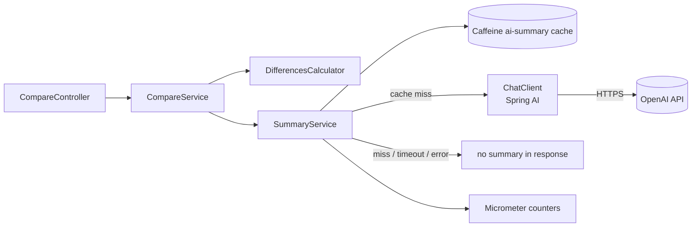

# SPEC-004 — AI Features

## 1. Scope

v1 ships **one** AI surface: the natural-language `summary` field on the
compare endpoint (SPEC-001 FR-8, SPEC-003 §2.3). Everything else in the
AI space — semantic search, embeddings, vector store, LLM-based filter
extraction, hybrid retrieval — is captured in `roadmap.md` (R-2, R-3,
R-4) and is intentionally out of scope here.

The guiding principle is **graceful degradation**: when the LLM is
unavailable, slow, misconfigured, or rate-limited, the comparison API
returns a fully usable response without `summary`. The product never
depends on the LLM being up.

## 2. Architecture



- `DifferencesCalculator` is fully deterministic and runs every time —
  it produces the `differences[]` array (SPEC-003 §2.3).
- `SummaryService` is invoked **after** `differences[]` is computed and
  is the only component that can fail without breaking the response.
- The `ChatClient` is a Spring AI bean abstracting the model. Tests
  inject a stub.

## 3. Configuration

| Property                    | Default               | Notes                                          |
|-----------------------------|-----------------------|------------------------------------------------|
| `spring.ai.openai.api-key`  | `${OPENAI_API_KEY:}`  | empty disables the LLM (deterministic mode)    |
| `spring.ai.openai.chat.options.model` | `gpt-5.4-nano` | nano tier; quality is fine for a ≤ 60-word factual paragraph |
| `spring.ai.openai.chat.options.temperature` | `0.2`   | low — we want stable, factual prose            |
| `app.ai.timeout-ms`         | `2000`                | hard cap; exceeded = fallback                  |
| `app.ai.daily-request-limit`| `0` (disabled)        | optional cost guard                            |
| `app.ai.cache.maximum-size` | `1000`                | Caffeine entries                               |
| `app.ai.cache.ttl-minutes`  | `60`                  | inferences are stable; refresh hourly          |

The presence of `OPENAI_API_KEY` is the **single switch**, **gated in
`SummaryService`** (not by autoconfig presence). Spring AI 1.0.0-M3's
`OpenAiAutoConfiguration` refuses to start with an empty `api-key`,
so `application.yml` declares
`spring.ai.openai.api-key: ${OPENAI_API_KEY:disabled}` to keep boot
deterministic. The `ChatClient` bean exists with a placeholder key,
but `SummaryService` reads the real env var on every call and
short-circuits when it is unset or equal to the placeholder, returning
`Optional.empty()` and incrementing
`ai_fallback_total{reason=no_key}` before any HTTP call is made.

## 4. Prompt management

Prompts live as versioned resources under
`src/main/resources/prompts/`:

```
prompts/
└── compare-summary.v1.md
```

- Each prompt file has a short header (purpose, expected inputs, output
  contract) and the prompt template itself with named placeholders.
- Versioning is **by filename**: a new version (`v2.md`) is added side
  by side, never edited in place. The active version is referenced by
  constant in `SummaryService`.
- Templates are loaded once at startup and held in memory.
- Each template ships with a **golden test** that pins a deterministic
  expected output for a fixed product pair, using a stubbed
  `ChatClient`. Regression: changing the template forces an explicit
  test update.

The v1 prompt accepts:

- `language` — `pt-BR` or `en`.
- `products` — JSON-rendered list of the compared items (slim shape:
  `id`, `name`, `category`, `buyBox.price + currency`, top
  `attributes` keys).
- `differences` — the deterministic diff already computed.

The prompt instructs the model to produce a **single paragraph**, ≤ 60
words, factual, no hallucinated specs, no marketing language, in the
requested language. The model is told that `differences` is the source
of truth — it must not invent values.

## 5. Caching

Two-layer caching:

1. **Per-product Caffeine cache** (`products`) — populated by the
   single-product GET; reused by compare to avoid repeat repository
   hits. Not AI-specific.
2. **AI summary Caffeine cache** (`ai-summary`) — keyed by
   `(sortedIds, fields, language)`. Stored value is the raw summary
   string. Misses go to the LLM; hits are returned immediately and
   counted as `ai_calls_total{kind=summary, outcome=cache_hit}`.

Both caches expose stats via Spring Boot Actuator's `caches` endpoint
and via `cache_*` Micrometer meters.

## 6. Fallback policy

| Trigger                                | Behavior                                         | Metric                                     |
|----------------------------------------|--------------------------------------------------|--------------------------------------------|
| `OPENAI_API_KEY` empty                 | skip call, no summary                            | `ai_fallback_total{reason=no_key}`         |
| Daily budget exceeded                  | skip call, no summary                            | `ai_fallback_total{reason=budget}`         |
| Timeout (`app.ai.timeout-ms`)          | cancel call, no summary                          | `ai_fallback_total{reason=timeout}`        |
| HTTP 4xx from OpenAI (excl. 401)       | log warn, no summary                             | `ai_fallback_total{reason=client_error}`   |
| HTTP 401 from OpenAI                   | log warn, mark key as invalid for the boot,      | `ai_fallback_total{reason=auth}`           |
|                                        | no summary on subsequent calls until restart     |                                            |
| HTTP 5xx from OpenAI                   | log warn, no summary                             | `ai_fallback_total{reason=server_error}`   |
| Any exception from `ChatClient`        | log warn, no summary                             | `ai_fallback_total{reason=exception}`      |

In **every** case, the compare endpoint still returns 200 with the full
deterministic payload. The `summary` field is simply absent — the
contract documents this explicitly (SPEC-003 §2.3).

## 7. Observability

Micrometer meters emitted by `SummaryService`:

| Meter                                                      | Type    | Tags                                  |
|------------------------------------------------------------|---------|---------------------------------------|
| `ai_calls_total`                                           | counter | `kind=summary`, `outcome=ok\|cache_hit\|timeout\|error\|fallback` |
| `ai_latency_seconds`                                       | timer   | `kind=summary`                        |
| `ai_tokens_total`                                          | counter | `kind=summary`, `direction=in\|out`   |
| `ai_fallback_total`                                        | counter | `reason=...` (see §6)                 |
| `cache_hits_total`                                         | counter | `cache=ai_summary\|products` (Spring) |

These are visible at `/actuator/metrics/<name>` and aggregate cleanly
into a Prometheus scrape later (roadmap R-7).

## 8. Cost guard

`app.ai.daily-request-limit` is checked before every non-cached call.
The counter is in-process (resets on restart), which is acceptable for
a local-only deliverable. When the budget is exhausted, the service
behaves as if the LLM were unavailable (§6 row "Daily budget exceeded").

The default is `0` (disabled). The README documents how to set a sane
ceiling for a public demo.

## 9. Testing strategy

| Layer            | Strategy                                                              |
|------------------|-----------------------------------------------------------------------|
| `DifferencesCalculator` | Pure function; exhaustive unit tests including ties, mixed types, currency mismatch (`isComparable=false`), missing keys |
| `SummaryService` | Stubbed `ChatClient`: assert prompt rendering, language switch, timeout, error handling, cache hit |
| Compare endpoint | MockMvc tests with both LLM-on (stub) and LLM-off profiles; verifies that absence of summary never breaks the response |
| Prompt fidelity  | Golden test pinning a fixed `(products, differences, language)` → expected stub output; flags accidental prompt edits |
| Coverage gate    | JaCoCo ≥ 80 % on `service` package, including AI paths |

The real OpenAI client is **never** called in tests. CI runs entirely
offline.

## 10. Out of scope (v1)

- Embeddings, vector store, semantic search → `roadmap.md` R-2
- LLM filter extraction for search → `roadmap.md` R-3
- Per-tenant or per-category prompt selection → `roadmap.md` R-4
- Streaming responses (SSE/WebSocket) → not planned
- Multi-provider fallback (e.g. local Ollama on OpenAI failure) → not
  planned for v1; the deterministic fallback is the contract

## 11. Open questions

- **Q-1** — Should the LLM call be issued **in parallel** with the
  deterministic diff so total latency stays close to the LLM's? *Proposed:
  yes — `CompletableFuture` started right after id resolution; joined
  with timeout before serializing the response. Decide in planning.*
- **Q-2** — Should `summary` carry the model name and a generation
  timestamp for traceability? *Proposed: not in the response body
  (noise for the consumer); emit as a structured log line keyed by
  request id.*

## 12. Changelog

- **v3 (2026-04-29)** — Default model switched to `gpt-5.4-nano`
  (smaller/faster than `gpt-4o-mini`; output quality acceptable for a
  ≤ 60-word factual summary). No other behavior changes.
- **v2 (2026-04-28)** — Clarified gate location: `SummaryService` owns
  the empty-key short-circuit. `application.yml` carries
  `spring.ai.openai.api-key: ${OPENAI_API_KEY:disabled}` so boot is
  deterministic with or without the env var. Discovered while smoke-
  booting Step 1 of the plan: Spring AI 1.0.0-M3 auto-config
  hard-fails when the property is empty.
- **v1 (2026-04-28)** — Initial draft. Single AI feature: comparison
  summary with strict fallback, cache, metrics, and prompt versioning.
  Embeddings/search explicitly out of scope and traced to roadmap.
