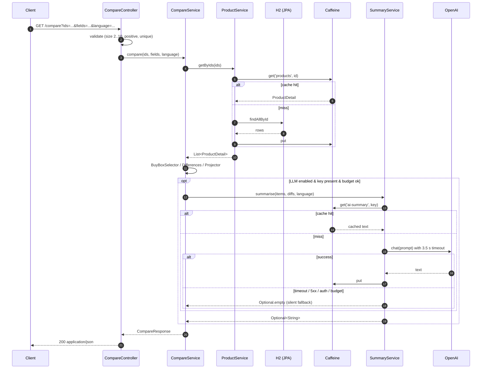

# Walkthrough

A linear tour of the service for someone with ten minutes. The
[specs](specs/) and [ADRs](adrs/) carry the contractual detail; this
file connects the dots and explains *why* each piece looks the way it
does.

## Menu

- [The problem in one paragraph](#the-problem-in-one-paragraph)
- [Why hybrid: lexical + LLM](#why-hybrid-lexical--llm)
- [`/compare` — anatomy of one request](#compare--anatomy-of-one-request)
- [`/category-insights` — what changes](#category-insights--what-changes)
- [How the AI summary is actually built](#how-the-ai-summary-is-actually-built)
- [SDD — the slices that shipped](#sdd--the-slices-that-shipped)
- [Decisions worth questioning](#decisions-worth-questioning)
- [What is deliberately not here](#what-is-deliberately-not-here)

---

## The problem in one paragraph

Comparing items in an e-commerce catalogue is a *hybrid* problem.
Some questions are factual and tabular — *which one has more battery?
which is cheaper? which is heavier?* — and the answer must be
deterministic, identical on every call, and auditable. Other
questions are subjective and prose-shaped — *given everything I see
above, which one fits a budget shopper?* — and read better as one
well-written paragraph than as a row of cells. This service treats
the two as separate concerns and gives the LLM a **narrow,
narrative-only** job.

---

## Why hybrid: lexical + LLM

Two failure modes of *let the LLM decide everything*:

1. **Hallucinated facts.** A model asked to compare prices and specs
   will occasionally invent a number, miscount RAM, or swap two
   products. Acceptable for chat, unacceptable for a comparison API.
2. **Non-determinism.** Two identical requests must yield identical
   `differences[]`. LLMs do not guarantee that.

Two failure modes of *no LLM at all*:

1. The reader has to decode a 12-row table.
2. The product never feels modern.

So we split the responsibilities:

| Concern               | Where it lives             | Determinism  |
|-----------------------|----------------------------|--------------|
| Resolving the buyBox  | `BuyBoxSelector`           | yes          |
| Computing differences | `DifferencesCalculator`    | yes          |
| Selecting picks       | `Picks` (insights service) | yes          |
| Filtering rankings    | `InsightsFilters`          | yes          |
| `summary` prose       | `SummaryService` → OpenAI  | best-effort  |

The LLM never decides who wins. It receives the pre-computed winner
ids and the per-product *winning axes* (`wins` map) and is told,
verbatim in the prompt, *narrate, never replace*. Few-shot examples
in [`compare-summary.v2.md`](../src/main/resources/prompts/compare-summary.v2.md)
demonstrate the shape and pin down the output format (single
paragraph, ≤ 90 words, locale-aware currency).

---

## `/compare` — anatomy of one request

Service-level sequence for `GET /api/v1/products/compare?ids=1,2&language=pt-BR`:



Step by step:

1. **Validation** lives in the controller layer. Missing `ids`,
   fewer than two, more than ten, duplicates, non-positive — all
   return a `400 validation` problem before any service is touched.
2. **Resolution** uses `ProductService` with a Caffeine cache keyed
   on `id`. A bulk `getByIds` is tried first; if some ids are
   missing, the code falls back to a per-id loop so the resulting
   404 lists *exactly* which ids failed (`products-not-found`).
3. **Differences** are computed against the **intersection** of
   attribute keys across products. Attributes that exist in only
   some products go into `exclusiveAttributes` and the response
   carries `crossCategory: true`. Within each comparable path the
   engine parses values via `NumericValue`, looks up the direction
   (higher-better / lower-better) in `attribute-metadata.json`, and
   sets `winnerId` accordingly.
4. **Sparse projection** lets the client ask
   `fields=name,buyBox.price` and receive only those paths in
   `items[]`, while `differences[]` is also restricted to the
   picked paths. Logic is in `FieldSetProjector`.
5. **Summary** is the only step that may fail without failing the
   request. See the next section.
6. **Response** is built in `CompareResponse` (a Java record). Empty
   `exclusiveAttributes` collapses to `null` so the JSON omits the
   field entirely.

---

## `/category-insights` — what changes

Same shape, different question. Instead of *compare these N
products*, the question is *give me a buying-guide view of category
X, optionally narrowed by price and rating*.

Pipeline:

1. `InsightsFilters` validates `minPrice / maxPrice / minRating` and
   the filter is applied **before** the ranking — there is no point
   ranking products the user already ruled out.
2. `CategoryInsightsService` builds three deterministic artefacts:
   - `rankings[]` — one entry per attribute path, with comparability,
     winner, runner-up and a numeric `spread`.
   - `topItems[]` — heuristic top-K by a deterministic score.
   - `Picks` — `bestOverall`, `bestValue`, `cheapest`, decided in
     code, **not by the LLM**.
3. The LLM receives the rankings, top items, picks, and (when
   present) the user's filter slice. It is told to write a
   buying-guide paragraph *over the slice the user actually asked
   about*. Filters change the cache key prefix from `v3` to `v3.1`,
   so a filtered call never reuses an unfiltered summary, and vice
   versa.

The cache-key construction lives in
[`SummaryService#insightsCacheKey`](../src/main/java/com/hackerrank/sample/service/ai/SummaryService.java).

---

## How the AI summary is actually built

`SummaryService` runs the same three-phase loop for both endpoints:

```
hasUsableApiKey?  -- no -->  fallback(no_key)
       | yes
       v
cache.get(key)    -- hit -->  return cached, mark cache_hit
       | miss
       v
budget.tryConsume() -- no --> fallback(budget)
       | yes
       v
prompt = template + bindings
chatModel.call(prompt) within 3.5 s timeout
       | success                | timeout       | 401/403       | 5xx
       v                        v               v               v
cache.put(key, text)      fallback(timeout) fallback(auth)  fallback(server)
return Optional.of(text)
```

The shape that matters:

- **Prompts are versioned files**, not strings in code.
  `compare-summary.v2.md` and `category-insights.v3.md` live under
  `src/main/resources/prompts/`. The version string is part of the
  cache key, so editing a prompt invalidates only its own bucket.
- **The `wins` map** is built on the server, fed to the prompt, and
  *not* exposed in the JSON response. The LLM needs it to ground
  the prose; the client does not.
- **`Picks` for `/category-insights`** are computed deterministically.
  The LLM only narrates them. After slice 5 smoke testing,
  `bestValue` was promoted from a pure rating/price ratio to a
  quality-anchored score because the smoke run exposed it picking
  very cheap, very low-rated items. That change was pushed back
  into [SPEC-005](specs/005-category-insights.md) before the code
  was touched.
- **`DailyBudget`** is a per-day in-memory counter. When the daily
  cap is reached, `tryConsume()` returns false and the service skips
  straight to fallback — no call to OpenAI is made.
- **Auth failures latch.** A 401 on the first call sets
  `keyInvalidForBoot = true`, so subsequent requests in the same
  process skip the network and return fallback immediately.

Every fallback path increments
`ai_calls_total{outcome="fallback"}` and
`ai_fallback_total{reason=...}`. Cache hits, latencies and token
counts are also recorded — see `AiMetrics`.

---

## SDD — the slices that shipped

This project was specified before it was implemented. Every slice
opened a spec or ADR change first, ran through review, and only then
was code written and tested. Each `T-NN` task in
[`execution/TASKS.md`](execution/TASKS.md) maps to one atomic commit.

| Slice | Spec / ADR landed       | Code that shipped                                      | Why it mattered                                 |
|------:|-------------------------|--------------------------------------------------------|-------------------------------------------------|
| 1     | SPEC-002, ADR-0003      | `CatalogProduct + Offer`, JPA, seed loader             | A real-shaped catalogue, not "Product"-flat     |
| 2     | SPEC-003                | Product + paged listing endpoints, RFC 7807            | A consistent contract for everything that follows |
| 3     | SPEC-001 v6, ADR-0004   | `/compare`, BuyBox heuristic, differences, sparse fields | The deterministic core                          |
| 4     | SPEC-004                | `SummaryService`, prompts v2, cache, fallback, metrics | The narrative layer, kept off the critical path |
| 5     | SPEC-005, ADR-0005/6    | `/category-insights` + structured filters              | A second LLM use case re-using the same gateway |

Two examples of *re-flow* — feedback during implementation that
went back into the spec instead of being patched in code:

- **`bestValue` quality anchor** — slice 5 smoke testing showed the
  pick favouring rating/price ratio over actual quality. SPEC-005
  was bumped before the fix landed in code.
- **In-memory filters with a documented scale-up path** —
  [ADR-0006](adrs/0006-insights-filters-in-memory-with-scale-up-path.md)
  was opened during slice 5 planning, when the alternative of
  pushing predicates into JPA was on the table. The ADR records
  the chosen path *and* the trigger and approach for moving to
  predicates later. The decision is reversible, on purpose.

---

## Decisions worth questioning

A reviewer should poke at these. Each links to the ADR with
alternatives, tradeoffs and consequences spelled out.

| Question                                                       | Where it is decided |
|----------------------------------------------------------------|---------------------|
| Why keep the HackerRank `com.hackerrank.sample` package layout?| [ADR-0003](adrs/0003-keep-skeleton-paste-friendly-submission.md) |
| Why this specific buyBox tie-break order?                      | [ADR-0004](adrs/0004-buybox-selection-heuristic.md) |
| Why is `/category-insights` one endpoint, not three?           | [ADR-0005](adrs/0005-category-insights-endpoint-shape.md) |
| Why filters in memory and not as JPA predicates?               | [ADR-0006](adrs/0006-insights-filters-in-memory-with-scale-up-path.md) |
| Why fallback silently instead of returning a degraded payload? | [SPEC-004 §6](specs/004-ai-features.md) |
| Why H2 and not Postgres?                                       | [Roadmap R-1](roadmap.md) |

---

## What is deliberately not here

| Item                                  | Where it lives now |
|---------------------------------------|--------------------|
| Auth, write endpoints                 | not planned        |
| Persistent DB                         | Roadmap R-1        |
| Semantic search                       | Roadmap R-2 / R-3  |
| LLM filter extraction                 | Roadmap R-3        |
| Rate limiting                         | Roadmap R-6        |
| Multi-currency                        | Roadmap R-8        |

Every roadmap entry is shaped *trigger → approach → architecture →
tradeoffs → effort*. None of them is "would be nice".
